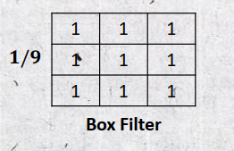
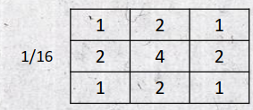
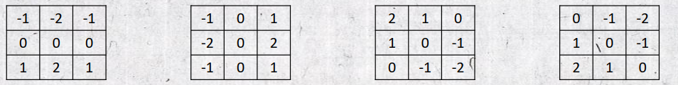
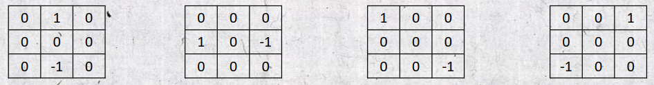
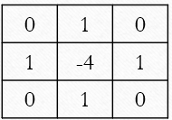
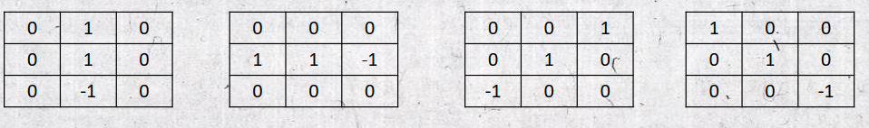
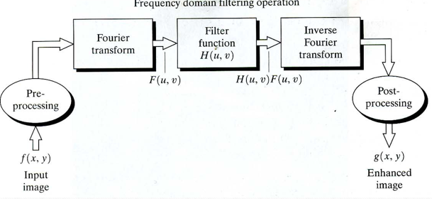
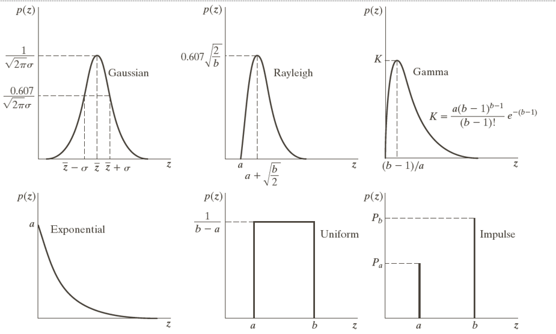

# Matlab Project Summary

## Project Video


<video src="https://github.com/user-attachments/assets/4e1d4762-e5a9-442d-a402-e9accb71fe16"></video>

## commands in Matlab

- `imread` is used to read an image in Matlab.
- `imshow` is used to display an image in Matlab.
- `%` is used to comment in Matlab.
- `clc` is used to clear the command window.
- `clear all` is used to clear the workspace.
- `matlab\toolbox\images\imdata\circles.png` path to find the image in Matlab.
- `figure,imshow()` is used to display single or
- `rgb2gray` is used to convert RGB image to grayscale image in Matlab.
- `im2bw` is used to convert RGB image to binary image in Matlab.
- `c(:,:,1) c(:,:,2) c(:,:,3)` is used to extract the red, green and blue channels of the image in Matlab.
- `size()` is used to get the size of the image in Matlab.
- `disp()` displays the value of variable
- `zeros()` is used to create an image of zeros in Matlab.
- `uint8` is used to create an image of unsigned 8-bit integers in Matlab because float number become zero.
- `img2double` is used to convert image to double in Matlab.
- `logical()` is used to convert 0,1 int to true and false(and or xor ) logical in Matlab.
- `Define Function in Matlab:`

```
function [output_args] = function_name(input_args)
    % Function body
    % Perform computations here
end
```

<hr>

<h3 style="
  font-family: Arial, Helvetica, sans-serif;
  background: linear-gradient(to right, #f32170, #ff6b08, #cf23cf, #eedd44);
  -webkit-text-fill-color: transparent;
  -webkit-background-clip: text;
">| Convert RGB image to grayscale </h3>

```

function [gray] = RGBTOGRAY(RGB, option)
    % Function to convert RGB image to grayscale

    [H, W, L] = size(RGB);
    gray = zeros(H, W);
    gray = double(gray);

    for i = 1:H
        for j = 1:W
            if option == 1
                gray(i, j) = (RGB(i, j, 1) + RGB(i, j, 2) + RGB(i, j, 3)) / 3;
            elseif option == 2
                gray(i, j) = RGB(i, j, 1) * 0.7 + RGB(i, j, 2) * 0.1 + RGB(i, j, 3) * 0.2;
            elseif option == 3
                gray(i, j) = RGB(i, j, 1);
            elseif option == 4
                gray(i, j) = RGB(i, j, 2);
            elseif option == 5
                gray(i, j) = RGB(i, j, 3);
            end
        end
    end

    gray = uint8(gray);
end
`1` Average method (R+G+B)/3.
`2` Luminance method (R0.7 + G0.1 + B*0.2).
`3` Red channel (R).
`4` Green channel (G).
`5` Blue channel (B).
```

<h3 style="
  font-family: Arial, Helvetica, sans-serif;
  background: linear-gradient(to right, #f32170, #ff6b08, #cf23cf, #eedd44);
  -webkit-text-fill-color: transparent;
  -webkit-background-clip: text;
">|  Convert grayscal image to binary image </h3>
  
```
function [ binary ] = Gray2Binary( gray,threshold )
[H, W, ~]=size(gray);
binary=zeros(H,W);
for i=1:H
    for j=1:W
        if gray(i,j)< threshold 
            binary(i,j)=0;
        end
        if gray(i,j)>= threshold 
            binary(i,j)=1;
        end
    end
end
binary=logical(binary);%convert 0,1 int to true and false logical 
imshow(binary);
end
```
<h3 style="
  font-family: Arial, Helvetica, sans-serif;
  background: linear-gradient(to right, #f32170, #ff6b08, #cf23cf, #eedd44);
  -webkit-text-fill-color: transparent;
  -webkit-background-clip: text;
">| Convert RGB image to binary image </h3>

```
function binary = RGB2Binary(rgb, threshold)
    [H, W, ~] = size(rgb);
    binary = zeros(H, W);

    for i = 1:H
        for j = 1:W
            % Convert RGB to grayscale using the average method
            grayValue = mean(rgb(i, j, :));

            % Apply threshold
            if grayValue < threshold
                binary(i, j) = 0;
            else
                binary(i, j) = 1;
            end
        end
    end

    binary = logical(binary);  % Convert 0, 1 to true and false logical
    imshow(binary);
end

```

<hr>

<h3 style="
  font-family: Arial, Helvetica, sans-serif;
  background: linear-gradient(to right, #f32170, #ff6b08, #cf23cf, #eedd44);
  -webkit-text-fill-color: transparent;
  -webkit-background-clip: text;
">| Point Processing : Transformation Functions </h3>
<hr>

<h3 style="
  font-family: Arial, Helvetica, sans-serif;
  background: linear-gradient(to right, #f32170, #ff6b08, #cf23cf, #eedd44);
  -webkit-text-fill-color: transparent;
  -webkit-background-clip: text;
">| Brightness and Darkness</h3>

```
function [new_image] = Brightness_Darkness(old_image, offset, option)
    [H, W, L] = size(old_image);
    new_image = zeros(H, W, L);
    old_image = im2double(old_image);
    for i = 1:H
        for j = 1:W
            for k = 1:L
                if (option == 1)
                    new_image(i, j, k) = min(1, old_image(i, j, k) + offset);
                elseif (option == 2)
                    new_image(i, j, k) = min(1, old_image(i, j, k) * offset);
                elseif (option == 3)
                    new_image(i, j, k) = max(0, old_image(i, j, k) - offset);
                elseif (option == 4)
                    if offset ~= 0
                        new_image(i, j, k) = min(1, old_image(i, j, k) / offset);
                    else
                        new_image(i, j, k) = old_image(i, j, k);
                    end
                end
            end
        end
    end

    imshow(new_image);
end
```

<h3 style="
  font-family: Arial, Helvetica, sans-serif;
  background: linear-gradient(to right, #f32170, #ff6b08, #cf23cf, #eedd44);
  -webkit-text-fill-color: transparent;
  -webkit-background-clip: text;
">| Logarithmic Transformation </h3>

```
function [new_image] = LogTransform(old_image)
[H, W, L] = size(old_image);
disp(L);
new_image = zeros(H, W, L);
old_image = im2double(old_image);

for i = 1:H
    for j = 1:W
        for k = 1:L
            new_image(i, j, k) = log(old_image(i, j, k) + 1);
        end
    end
end
imshow(new_image);
end

```

<h3 style="
  font-family: Arial, Helvetica, sans-serif;
  background: linear-gradient(to right, #f32170, #ff6b08, #cf23cf, #eedd44);
  -webkit-text-fill-color: transparent;
  -webkit-background-clip: text;
">| Negative Transformation </h3>

```
function new = negative_tranform(img)
    [H, W, L] = size(img);
    new = zeros(H, W);
        img = im2double(img);

        for i = 1:H
            for j = 1:W
                for k = 1:L
                    new(i, j, k) = 1 - img(i, j, k);
                end
            end
        end

    imshow(new);
end
```

<h3 style="
  font-family: Arial, Helvetica, sans-serif;
  background: linear-gradient(to right, #f32170, #ff6b08, #cf23cf, #eedd44);
  -webkit-text-fill-color: transparent;
  -webkit-background-clip: text;
">| Gamma Transformation </h3>

```
function [newimage] = Gamma_equation(image, value)

[H, W, L] = size(image);
newimage = zeros(H, W, L);
image = im2double(image);

for i = 1:H
    for j = 1:W
        if L == 3
            newimage(i, j, 1) = image(i, j, 1)^value;
            newimage(i, j, 2) = image(i, j, 2)^value;
            newimage(i, j, 3) = image(i, j, 3)^value;
        else
            newimage(i, j, 1) = image(i, j, 1)^value;
        end
    end
end
end
```

<h3 style="
  font-family: Arial, Helvetica, sans-serif;
  background: linear-gradient(to right, #f32170, #ff6b08, #cf23cf, #eedd44);
  -webkit-text-fill-color: transparent;
  -webkit-background-clip: text;
">| Histogram Display</h3>

```
function [array] = histogram( image )
[H, W, L]=size(image);
if L == 3
    R_array=zeros(256,1);% matlab is not zero index ##
    G_array=zeros(256,1);
    B_array=zeros(256,1);
    for i = 1:H
        for j =1:W
            R_array(image(i,j,1)+1)=R_array(image(i,j,1)+1)+1;
            G_array(image(i,j,2)+1)=G_array(image(i,j,2)+1)+1;
            B_array(image(i,j,3)+1)=B_array(image(i,j,3)+1)+1;
        end
    end
    array=[R_array,G_array,B_array];
hb = bar(array);
hb(1).FaceColor = 'r';
hb(2).FaceColor = 'g';
hb(3).FaceColor = 'b';
else
array=zeros(256,1);
    for i = 1:H
        for j =1:W
            array(image(i,j)+1)=array(image(i,j)+1)+1;
        end
    end

    bar(array);
end
end
```

<h3 style="
  font-family: Arial, Helvetica, sans-serif;
  background: linear-gradient(to right, #f32170, #ff6b08, #cf23cf, #eedd44);
  -webkit-text-fill-color: transparent;
  -webkit-background-clip: text;
">| Contrast Stretching</h3>

```
function [ new_img ] = contruct_stretching ( old_img,new_min,new_max )
[r,c,l]=size(old_img);
old_img=double(old_img);
old_min=min(min(old_img));
old_max=max(max(old_img));
new_img=zeros(r,c,l);
if l==3
old_min1=min(min(old_img(:,:,1)));
old_min2=min(min(old_img(:,:,2)));
old_min3=min(min(old_img(:,:,3)));

old_max1=max(max(old_img(:,:,1)));
old_max2=max(max(old_img(:,:,2)));
old_max3=max(max(old_img(:,:,3)));
end
    for i=1:r
        for j=1:c
            if l==1
                new_img(i,j,1)=((old_img(i,j,1) - old_min) / (old_max - old_min)) * (new_max - new_min) + new_min;
            else
                new_img(i,j,1)=((old_img(i,j,1) - old_min1) / (old_max1 - old_min1)) * (new_max - new_min) + new_min;
                new_img(i,j,2)=((old_img(i,j,2) - old_min2) / (old_max2 - old_min2)) * (new_max - new_min) + new_min;
                new_img(i,j,3)=((old_img(i,j,3) - old_min3) / (old_max3 - old_min3)) * (new_max - new_min) + new_min;

            end

        end
    end
new_img = uint8(new_img);
imshow(new_img);
end
```

<h3 style="
  font-family: Arial, Helvetica, sans-serif;
  background: linear-gradient(to right, #f32170, #ff6b08, #cf23cf, #eedd44);
  -webkit-text-fill-color: transparent;
  -webkit-background-clip: text;
">| Histogram Equalization</h3>

```
function [result] = Histogram_Equalization(image)
    [H, W, L] = size(image);
    result = uint8(zeros(H, W, L));

    for channel = 1:L
        array = zeros(256, 1);
        prob = zeros(256, 1);
        prob = double(prob);
        sk = zeros(256, 1);

        for i = 1:H
            for j = 1:W
                pixel_value = image(i, j, channel) + 1;
                array(pixel_value) = array(pixel_value) + 1;
                prob(pixel_value) = array(pixel_value) / (H * W);% calculate the probability for each pixel
            end
        end

        sum = 0;
        sum = double(sum);
        for i = 1:256
            sum = sum + prob(i);
            sk(i) = 255 * (sum);
        end

        for i = 1:H
            for j = 1:W
                result(i, j, channel) = sk(image(i, j, channel) + 1);
            end
        end
    end
end
```

<hr>
<h3 style="
  font-family: Arial, Helvetica, sans-serif;
  background: linear-gradient(to right, #f32170, #ff6b08, #cf23cf, #eedd44);
  -webkit-text-fill-color: transparent;
  -webkit-background-clip: text;
">| Local Operations Spatial Filtering </h3>
<h4 style="
  font-family: Arial, Helvetica, sans-serif;
  background: linear-gradient(to right, #f32170, #ff6b08, #cf23cf, #eedd44);
  -webkit-text-fill-color: transparent;
  -webkit-background-clip: text;
"><li>Linear Filters</li> </h4>

`Mean Filter` Blurring & Smoothing & Averaging Sum=1

- `Box Filter ` All coefficients are Equal
  
- `Weighted Filter` all coefficient not Equal
  
- `Edge Detection Filters` Sum of mask elements must be 0
  - `Sobel Mask`
    
  - `Robert Mask`
    
  - `Point Detection`
    
- `Sharping Filters`
  - `Line Sharpening`
    
  - `Point Sharpening`
    

```
function [final_img  ] = LinearFilter( img,mask )
    [rm, cm] = size(mask);
    [r, c,l] = size(img);
    paddSr = floor(rm/2);
    paddsc = floor(cm/2);
    padding = zeros(r+(2*paddSr),c + (2*paddsc),l);
    for i=paddSr+1:r +paddSr
        for j=paddsc+1:c +paddsc
            if l==1
                padding(i,j)=img(i-paddSr,j-paddsc);
            elseif l==3
                padding(i,j,1)=img(i-paddSr,j-paddsc,1);
                padding(i,j,2)=img(i-paddSr,j-paddsc,2);
                padding(i,j,3)=img(i-paddSr,j-paddsc,3);
            end
        end
    end
    final_img = zeros(r, c,l);
   [rp, cp,l] = size(padding);
   for i=paddSr+1:rp-paddSr
        for j=paddsc+1:cp-paddsc
            sum = 0.0;
            sum1=0.0;sum2=0.0;sum3=0.0;
            for m = 1 : rm
                for n = 1 : cm
                    if l==1
                        sum=sum+(mask(m,n)*padding((i-paddSr)+m-1,(j-paddsc)+n-1));
                    elseif l==3
                        sum1=sum1+(mask(m,n)*padding((i-paddSr)+m-1,(j-paddsc)+n-1,1));
                        sum2=sum2+(mask(m,n)*padding((i-paddSr)+m-1,(j-paddsc)+n-1,2));
                        sum3=sum3+(mask(m,n)*padding((i-paddSr)+m-1,(j-paddsc)+n-1,3));
                    end
                end
            end
            if sum<0
                sum=0;
            elseif sum>255
                sum=255;
            end
            if sum1<0
                sum1=0;
            elseif sum1>255
                sum1=255;
            end
            if sum2<0
                sum2=0;
            elseif sum2>255
                sum2=255;
            end
            if sum3<0
                sum3=0;
            elseif sum3>255
                sum3=255;
            end
            if l==1
                final_img(i-paddSr,j-paddsc,1)=sum;
            elseif l==3
                final_img(i-paddSr,j-paddsc,1)=sum1;
                final_img(i-paddSr,j-paddsc,2)=sum2;
                final_img(i-paddSr,j-paddsc,3)=sum3;
            end
        end
   end
   final_img=uint8(final_img);
end
```

<h4 style="
  font-family: Arial, Helvetica, sans-serif;
  background: linear-gradient(to right, #f32170, #ff6b08, #cf23cf, #eedd44);
  -webkit-text-fill-color: transparent;
  -webkit-background-clip: text;
"><li>Non Linear Filters</li> </h4>

- `Min Filter ` take minium value (good for Salt)
- `Median Filter` take mid value (good for salt and peppers)
- `Max Filter`take maximum value (good for peppers)
- `MidPoint Filter` (min +max) / 2 (Good for random Gaussian and uniform noise)

```
function [ final_img ] = NonLinear( img,op )
    %op 1 --> min , 2 --> median ,3 --> midpoint ,4 --> max
    rm=3;cm=3;
    [r, c,l] = size(img);
    paddSr = floor(rm/2);
    paddsc = floor(cm/2);
     padding = zeros(r+(2*paddSr),c + (2*paddsc),l);
    for i=paddSr+1:r +paddSr
        for j=paddsc+1:c +paddsc
            if l==1
                padding(i,j)=img(i-paddSr,j-paddsc);
            elseif l==3
                padding(i,j,1)=img(i-paddSr,j-paddsc,1);
                padding(i,j,2)=img(i-paddSr,j-paddsc,2);
                padding(i,j,3)=img(i-paddSr,j-paddsc,3);
            end
        end
    end

   final_img = zeros(r, c,l);
   [rp, cp,l] = size(padding);
   for i=paddSr+1:rp-paddSr
        for j=paddsc+1:cp-paddsc
            index = 1;
            non_f = zeros(1, rm*cm);non_f1 = zeros(1, rm*cm);
            non_f2 = zeros(1, rm*cm);non_f3 = zeros(1, rm*cm);
            for m = 1 : rm
                for n = 1 : cm
                    if l==1
                        non_f(1,index)=padding((i-paddSr)+m-1,(j-paddsc)+n-1);
                        index=index+1;
                    elseif l==3
                        non_f1(1,index)=padding((i-paddSr)+m-1,(j-paddsc)+n-1,1);
                        non_f2(1,index)=padding((i-paddSr)+m-1,(j-paddsc)+n-1,2);
                        non_f3(1,index)=padding((i-paddSr)+m-1,(j-paddsc)+n-1,3);
                        index=index+1;
                    end
                end
            end

            if l==1
                non_f=sort(non_f);
                if op==1
                    final_img(i-paddSr,j-paddsc,1)=non_f(1);
                elseif op==2
                    final_img(i-paddSr,j-paddsc,1)=non_f(uint8((rm*cm)/2));
                elseif op==3
                    vmn=non_f(1);
                    vmx=non_f(rm*cm);
                    final_img(i-paddSr,j-paddsc,1)=uint8((vmn+vmx)/2);
                elseif op==4
                    final_img(i-paddSr,j-paddsc,1)=non_f(rm*cm);
                end
            elseif l==3
                non_f1=sort(non_f1);
                non_f2=sort(non_f2);
                non_f3=sort(non_f3);
                 if op==1
                    final_img(i-paddSr,j-paddsc,1)=non_f1(1);
                    final_img(i-paddSr,j-paddsc,2)=non_f2(1);
                    final_img(i-paddSr,j-paddsc,3)=non_f3(1);
                elseif op==2
                    final_img(i-paddSr,j-paddsc,1)=non_f1(uint8((rm*cm)/2));
                    final_img(i-paddSr,j-paddsc,2)=non_f2(uint8((rm*cm)/2));
                    final_img(i-paddSr,j-paddsc,3)=non_f3(uint8((rm*cm)/2));
                elseif op==3
                    vmn1=non_f1(1);vmn2=non_f2(1);vmn3=non_f3(1);
                    vmx1=non_f1(rm*cm);vmx2=non_f2(rm*cm);vmx3=non_f3(rm*cm);
                    final_img(i-paddSr,j-paddsc,1)=uint8((vmn1+vmx1)/2);
                    final_img(i-paddSr,j-paddsc,2)=uint8((vmn2+vmx2)/2);
                    final_img(i-paddSr,j-paddsc,3)=uint8((vmn3+vmx3)/2);
                elseif op==4
                    final_img(i-paddSr,j-paddsc,1)=non_f1(rm*cm);
                    final_img(i-paddSr,j-paddsc,2)=non_f2(rm*cm);
                    final_img(i-paddSr,j-paddsc,3)=non_f3(rm*cm);
                 end

            end
        end
    end

    final_img=uint8(final_img);
end

```

<hr>

<h3 style="
  position: block;
  font-family: Arial, Helvetica, sans-serif;
  background: linear-gradient(to right, #f32170, #ff6b08, #cf23cf, #eedd44);
  -webkit-text-fill-color: transparent;
  -webkit-background-clip: text;
">| Frequency Domain</h3>

<p>It consists of modifying the FT of an input image and then finding the IFT to get the output image. 
</p>

<h4 style="
  position: block;
>>>>>>> 34318a56b4d2ae335ace58262b8c70eee0c0ba6f
  font-family: Arial, Helvetica, sans-serif;
  background: linear-gradient(to right, #f32170, #ff6b08, #cf23cf, #eedd44);
  -webkit-text-fill-color: transparent;
  -webkit-background-clip: text;
"><li>Fourier Transformation</l></h4>

```
function [transformed] = FourierTransformation(img)
c = fft2(img);
ca = abs(c);
clog = log(1+ca);
f = mat2gray(clog);
transformed = fftshift(f);
end
```

<h4 style="
  position: block;
  font-family: Arial, Helvetica, sans-serif;
  background: linear-gradient(to right, #f32170, #ff6b08, #cf23cf, #eedd44);
  -webkit-text-fill-color: transparent;
  -webkit-background-clip: text;
"><li>Low-Pass Filter(Blurring,smoothing)</li></h4>
<p> A Filter that remove high frequency while keeping low frequency</p>

- `Ideal low-pass filter` (ILPF) (Very Sharp)
- `Butterworth low-pass filter` (BLPF)
- `Gaussian low-pass filter` (GLPF) (very smooth)
<h4 style="
  position: block;
  font-family: Arial, Helvetica, sans-serif;
  background: linear-gradient(to right, #f32170, #ff6b08, #cf23cf, #eedd44);
  -webkit-text-fill-color: transparent;
  -webkit-background-clip: text;
"><li>High-Pass Filter(Sharpening)</li></h4>
<p>
A filter that remove low frequency while keeping high frequency
</p>

- `Ideal high-pass filter` (IHPF)
- `Butterworth high-pass filter` (BHPF)
- `Gaussian high-pass filter` (GHPF)

> Ideal FIlter

```
function [ zz ] = Ideal_Filter(I,D0,index )
    [H W L]=size(I);
    filter=zeros(H,W,L);
    for j=1:H
        for k=1:W
            dist=sqrt((j-(H/2)).^2+(k-(W/2)).^2);
            if(dist<=D0)
                filter(j,k)=1;
            end

        end
    end
    if(index==0)
      filter=filter;
    else
        filter=1-filter;
    end
    fi=fft2(I);
    fi=fftshift(fi);
    reall=real(fi);
    imagin=imag(fi);
    nreall=filter.*reall;
    nimagin=filter.*imagin;
    NI=nreall(:,:)+i*nimagin(:,:);
    NI=fftshift(NI);
    NI=ifft2(NI);
    zz=mat2gray((abs(NI)));
end
```

```
function [result] = Ideal_Filter_RGB(image, D0, index)
    [H, W, L] = size(image);
    result = zeros(H, W, L);

    if L == 1
        result = Ideal_Filter(image, D0, index);
    else
        a = Ideal_Filter(image(:,:,1), D0, index);
        b = Ideal_Filter(image(:,:,2), D0, index);
        c = Ideal_Filter(image(:,:,3), D0, index);
        result = cat(3, a, b, c);
    end

    result = im2uint8(result);
end
```

> Butterworth Filter

```
function [zz] =Butterworth_Filter(image,D0,index)
[H W L]=size(image);
filter =zeros(H,W,L);
for j=1:H
    for k=1:W
        dist=sqrt((j-(H/2)).^2+(k-(W/2)).^2);
        filter(j,k)=(1/(1+(dist/D0).^(2)));
    end
end
if(index==0)
    filter = filter;
else
    filter=1-filter;
end

fi = fft2(image);
fi = fftshift(fi);
reall=real(fi);
imagin=imag(fi);
nreal=filter.*reall;
nimagin =filter.*imagin;
NI=nreal(:,:)+i*nimagin(:,:);
NI =fftshift(NI);
NI=ifft2(NI) ;
zz=mat2gray((abs(NI)));
end
```

```
function [result] = Butterworth_Filter_RGB(image, D0, index)
    [H, W, L] = size(image);
    result = zeros(H, W, L);
    if L == 1
        result = Butterworth_Filter(image, D0, index);
    else
        a = Butterworth_Filter(image(:,:,1), D0, index);
        b = Butterworth_Filter(image(:,:,2), D0, index);
        c = Butterworth_Filter(image(:,:,3), D0, index);
        result = cat(3, a, b, c);
    end

    result = im2uint8(result);
end
```

> Gaussian Filter

```
function [result] = Gaussian_Filter_RGB(image, D0, index)
    [H, W, L] = size(image);
    result = zeros(H, W, L);

    if L == 1
        result = Gaussian_Filter(image, D0, index);
    else
        a = Gaussian_Filter(image(:,:,1), D0, index);
        b = Gaussian_Filter(image(:,:,2), D0, index);
        c = Gaussian_Filter(image(:,:,3), D0, index);
        result = cat(3, a, b, c);
    end

    result = im2uint8(result);
end
```

```
function [ zz ] = Gaussian_Filter( I,D0,index )
[H W L]=size( I );
filter=zeros(H,W,L);
for j=1:H
    for k=1:W
        distance=sqrt((j-(H/2)).^2+(k-(W/2)).^2);
        filter(j,k)=exp((-(distance).^2)/(2*(D0.^2)));
    end
end
if (index==0)
    filter=filter;
else
    filter=1-filter;
end
fi=fft2(I);
fi=fftshift(fi);
reall=real(fi);
imagin=imag(fi);
nreall=filter.*reall;
nimagin=filter.*imagin;
NI=nreall(:,:)+i*nimagin(:,:);
NI=fftshift(NI);
NI=ifft2(NI);
zz=mat2gray((abs(NI)));
end
```

<hr>

<h3 style="
  position: block;
  font-family: Arial, Helvetica, sans-serif;
  background: linear-gradient(to right, #f32170, #ff6b08, #cf23cf, #eedd44);
  -webkit-text-fill-color: transparent;
  -webkit-background-clip: text;
">| Image Restoration </h3>
<p> 
Recover an image that has been degraded by noise(objective).
</p>

- Noise Probability Density Function
  - Gaussian (Normal) Noise
  - Rayleigh Noise
  - Erlang(Gamma) Noise
  - Exponential Noise
  - Uniform Noise
  - Bipolar Impulse Noise ( salt-and-pepper )



> Gaussian Noise

```
function [new_img] = Gaussian_noise_rgb(img, m, s)
    img = double(img);
    [H, W, L] = size(img);

    for c = 1:L % Loop through color channels
        for i = 1:255
            pixelCount = round(((exp((-(i-m)^2)/(2*s^2)))/(sqrt(2*pi)*s))*H*W);
            for j = 1:pixelCount
                row = ceil(rand(1, 1) * H);
                column = ceil(rand(1, 1) * W);
                img(row, column, c) = img(row, column, c) + i;
            end
        end
    end

    % Normalization
    new_img = zeros(size(img));
    for c = 1:L
        mn = min(min(img(:,:,c)));
        mx = max(max(img(:,:,c)));
        new_img(:,:,c) = ((img(:,:,c) - mn) / (mx - mn)) * 255;
    end

    % Convert to uint8
    new_img = uint8(new_img);
end
```

> Rayleigh Noise

```
function [h]=RayLeigh_Noise(img,a,b)
[w,h,l]=size(img);
new_image=img;
%figure,imshow(I);
for k=1:l
for i=0:255
    ns=(2*(i-a)*exp(power(i-a,2)/b))/b;

    ns=uint8(ns);
    for j=1:ns
    x=randi(w,1,1);
    y=randi(h,1,1);
    new_image(x,y,k)=new_image(x,y,k)+i;
    end
end
end
h=uint8(new_image);
end
```

> Erlang(Gamma) Noise

```
function [ new_img ] = Erlang_Gamma_Noise( img,a,b )
[H W L]=size(img);
for c = 1:L
    for i = 1:255
        pixelCount=round((((a.^b)*(i.^(b-1)))/(factorial(b-1)))*exp(-a*i)*H*W);
        for j = 1 :pixelCount
            row=ceil(rand(1,1)*H);
            column=ceil(rand(1,1)*W);
            img(row,column)=img(row,column)+i;
        end
    end
end
new_img = zeros(size(img));
new_img=stretching(img, 1,255);
new_img=uint8(new_img);
end
```

> exponential

```
function [ new_img ] = Exponential_Noise( img,a )
[H W L]=size(img);
for c = 1:L
    for i = 1:255
        pixelCount=round(a*exp(-a*i)*H*W);
        for j = 1 :pixelCount
            row=ceil(rand(1,1)*H);
            column=ceil(rand(1,1)*W);
            img(row,column)=img(row,column)+i;
        end
    end
end
new_img = zeros(size(img));
new_img=stretching(img, 1,255);
new_img=uint8(new_img);
end
```

> Uniform Noise

```
function [ new_img ] = uniform_noise( img, a, b )
img=double(img);
[H W L]=size(img);

pixelCount=round((1/(b-a))*H*W);
for c = 1:L
    for i=1:255
        for x=1:pixelCount
            row=ceil(rand(1, 1)*H);
            column=ceil(rand(1, 1)*W);
            img(row, column)=img(row, column)+i;
        end
    end
end
%Normalization
new_img=stretching(img, 1,255);
new_img=uint8(new_img);
end
```

> Bipolar Impulse Noise

```
function [ new_img ] = saltAndPepper( img,ps,pp )
[H W L]=size(img);

saltCount=round(ps*H*W);
pepperCount=round(pp*H*W);

for i=1:saltCount
    row=ceil(rand(1, 1)*H);
    column=ceil(rand(1, 1)*W);
    img(row, column)=255;
end

for i=1:pepperCount
    row=ceil(rand(1, 1)*H);
    column=ceil(rand(1, 1)*W);
    img(row, column)=0;
end
new_img=img;


end
```

"# Image-Processing-Project"
